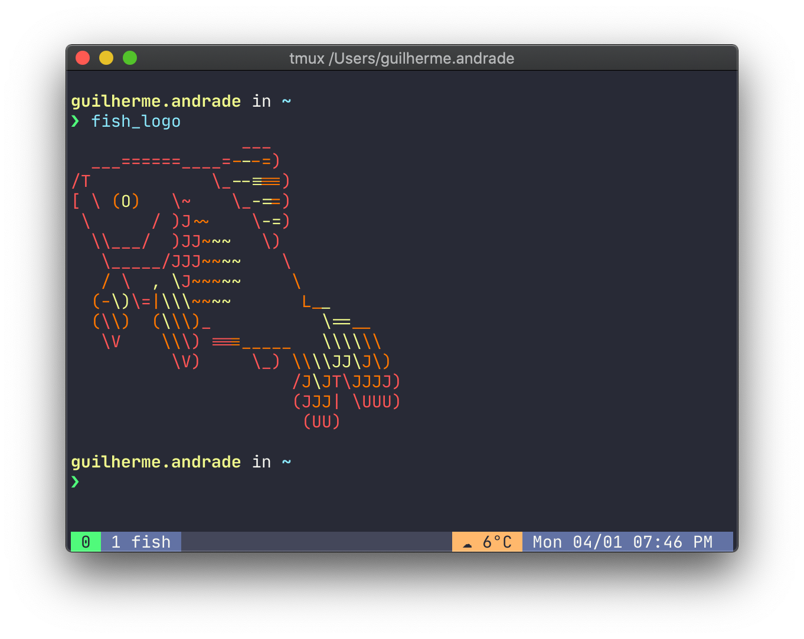

<p align="center">
   
</p>

# .dotfiles

[](https://github.com/guilhermedeandrade)

<br />

## :pushpin: Table of Contents

- [Introduction](#scroll-introduction)
- [Installation](#construction_worker-installation)
- [Getting Started](#runner-getting-started)
- [Notes](#spiral_notepad-notes)
- [Acknowledgments](#pray-acknowledgments)

## :scroll: Introduction

Configuration files for some tools that I use daily such as: kitty, fish, tmux &amp; nvim

## :construction_worker: Installation

**Setup**

```sh
git clone --separate-git-dir=$HOME/.dotfiles --single-branch --branch=main https://github.com/guilhermedeandrade/.dotfiles.git tmpdotfiles
rsync --recursive --verbose --exclude '.git' tmpdotfiles/ $HOME/
rm -r tmpdotfiles
```

Note that the `main` branch is meant to be used with macOS. The `--branch` flag should be changed to either `wsl` or `linux` if you aren't using it.

## :runner: Getting Started

**Staging**

```sh
dotfiles add <file-path>
```

**Commiting**

```sh
dotfiles commit -m "commit message"
```

**Pushing the changes**
```sh
dotfiles push
```

## :spiral_notepad: Notes

The `wsl` branch is outdated and the `linux` has yet to be created.

## :pray: Acknowledgments

Thanks to Anand Yver for writing an awesome [blog post](https://www.anand-iyer.com/blog/2018/a-simpler-way-to-manage-your-dotfiles.html) that shows us a simpler way to manage dotfiles.
